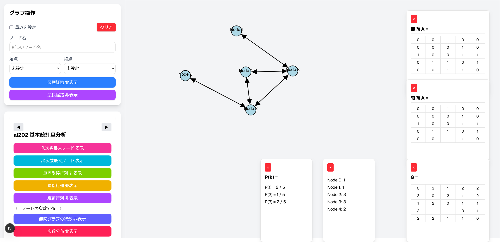
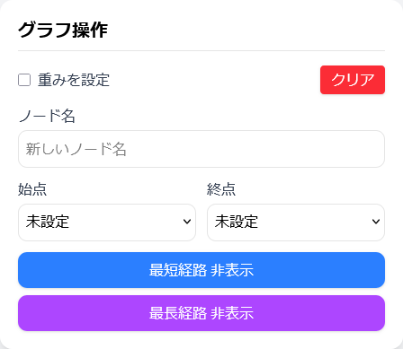
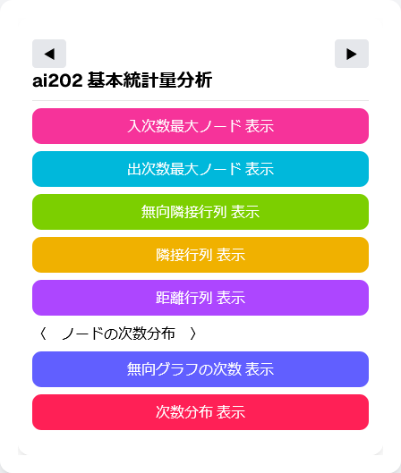
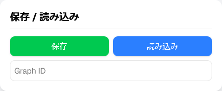
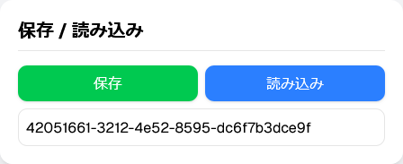
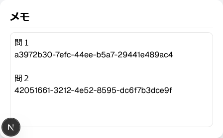

# Feelpath
## ネットワーク可視化・分析Webアプリ

このプロジェクトは、ブラウザ上でネットワーク（グラフ）を作成・編集・解析できるWebアプリです。ReactとNext.js（App Router）で実装されており、グラフの操作や統計解析を直感的に行えます。

---

## 主な機能

### ノード・エッジ操作
- クリックでノード追加
- ノードクリックでエッジ追加
- 右クリックでノード・接続エッジ削除
- ノード名のカスタマイズ可能
- 重み付きエッジの設定が可能

### 経路探索
- 最短経路探索（ダイクストラ法）
- 最長経路探索（DFSを利用）
- 経路の表示・非表示切替可能

### 統計分析
- 入次数・出次数最大ノードの確認
- 無向隣接行列の生成・表示
- 隣接行列・距離行列の生成・表示
- 無向グラフの各ノードの次数計算
- 次数分布の確認

### 保存・読み込み
- 作成したグラフをサーバーに保存
- 保存したグラフをIDで読み込み可能

### メモ機能
- 自由にメモを入力・保存可能

---

## 使用技術

- フレームワーク：Next.js（App Router方式）
- UI：React（Hooksベース）
- 描画：HTML Canvas API / SVG
- スタイリング：Tailwind CSS
- UIコンポーネント：shadcn/ui
- アニメーション：Framer Motion
- クライアント完全依存型SPA

---

## 起動方法

1. リポジトリをクローン
```bash
git clone <リポジトリURL>
cd <プロジェクトフォルダ>
```

2. 依存関係インストール
```bash
npm install
```

## 実行方法

### 1. バックエンド起動 (FastAPI)
ターミナルを開き、`main.py` があるディレクトリに移動して以下を実行します。

```bash
cd ~/project_app/feelpath/backend
uvicorn main:app --reload --port 8000
```
### 2. フロントエンド起動 (Next.js)
別のターミナルを開き、page.tsx があるフロントエンドディレクトリに移動して以下を実行します。

```bash
cd ~/project_app/feelpath/frontend/my-app
npm run dev
```

## 注意

フロントエンドとバックエンドは別々のターミナルで同時に起動する必要があります。

他のユーザーが使用する場合も、バックエンドが起動していないと一部機能（保存・読み込みなど）が動作しません。

## 使い方



1. **ノードの追加**  
   左メニューでノード名を入力してキャンバスをクリックすると、ノードを追加できます。

2. **エッジの作成**  
   ノードをクリックして、エッジを作成可能です。重みも設定できます。

3. **始点・終点の設定,経路表示**  
   ノードを選択して、始点・終点を設定できます。
   「最短経路」「最長経路」ボタンを押すと、経路が表示されます。
  

5. **学習カードでの分析**  
   - 次数分析  
   - 行列表示  
   - 次数分布の確認
  

6. **グラフの保存・読み込み**  
   保存ボタンでサーバーにグラフを保存できます。
     
   保存時に発行されるIDを使って、いつでもグラフを読み込むことが可能です。
   

8. **メモ入力**  
   メモ欄で自由にメモを入力できます。
  

